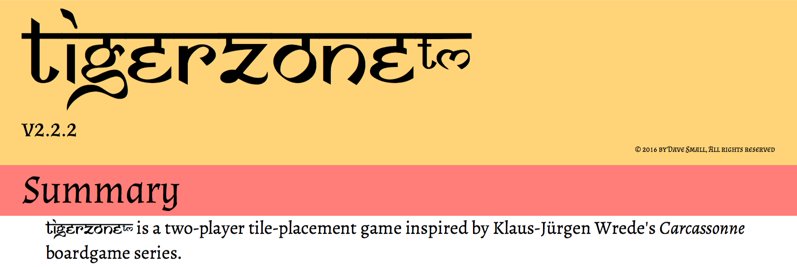
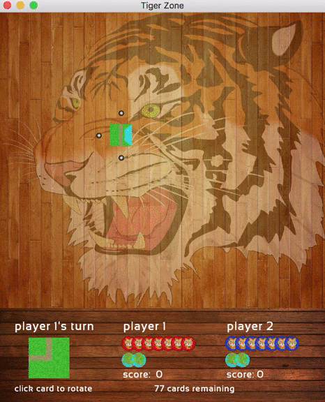

# CEN3031 Project - Tiger Zone

 

<!--- and
[How To Play](https://github.com/thomas1242/Tiger-Zone/blob/master/Game Rules/TigerZone - Tournament Rules v2.2.pdf)
-->

## Overview

Players take turns placing tiles. As they so do, the roads, lakes, and jungles emerge and grow.

Players may place tigers to claim territories. A tiger may be placed in any jungle, lake, road or den which does *not* already contain a tiger.

 

